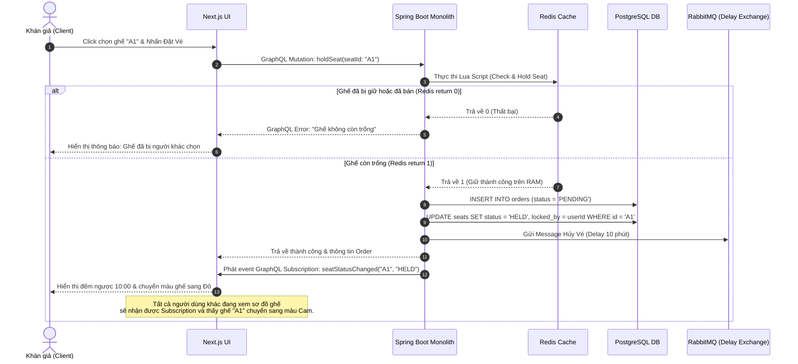
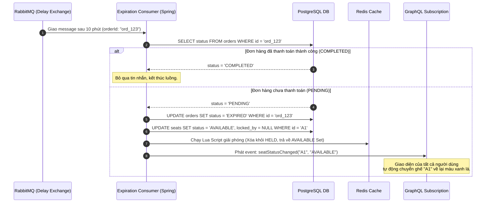

# System Architecture & Design Document - TicketRush

## 1. PHÂN TÍCH THIẾT KẾ KỸ THUẬT (Technical Breakdown)

Hệ thống **TicketRush** được xây dựng theo mô hình **Monolith** nhưng tuân thủ thiết kế phân lớp rõ ràng (Layered Architecture) kết hợp với các cổng giao tiếp độc lập (Ports and Adapters / Hexagonal Architecture). Điều này giúp hệ thống dễ bảo trì, dễ viết test và sẵn sàng chuyển đổi sang Microservices khi cần thiết.

---

## 2. KIẾN TRÚC VẬN HÀNH (Runtime & Infrastructure Architecture)

Hệ thống bao gồm các thành phần hạ tầng cốt lõi:
1.  **Next.js 16 Web Client:** Chạy môi trường Node.js phía Client, giao tiếp qua GraphQL HTTP (Queries/Mutations) và WebSockets (Subscriptions).
2.  **Spring Boot Monolith Application:** Chạy trên môi trường JVM 21, lắng nghe trên 2 cổng:
    *   **Port 8080:** HTTP/WebSocket Server phục vụ GraphQL API.
    *   **Port 50051:** gRPC Server phục vụ soát vé check-in.
3.  **Redis Cache & In-Memory Store:**
    *   Lưu thông tin vị trí ghế trống của từng zone (`concert:{id}:zone:{id}:available`) dưới dạng Set.
    *   Lưu thông tin các ghế đang bị giữ (`concert:{id}:held`) dưới dạng Hash.
    *   Lưu trữ Idempotency Key của giao dịch thanh toán.
4.  **RabbitMQ Message Broker:**
    *   Sử dụng `rabbitmq_delayed_message_exchange` plugin để tạo hàng đợi tin nhắn trì hoãn phục vụ nghiệp vụ thu hồi vé hết hạn thanh toán (Ticket timeout).
5.  **PostgreSQL Relational DB:**
    *   Lưu trữ dữ liệu có cấu trúc ổn định và bền vững (Users, Concerts, SeatZones, Seats, Orders, Tickets).

---

## 3. THIẾT KẾ CHI TIẾT CÁC LUỒNG XỬ LÝ (Sequence Diagrams - Mermaid)

Dưới đây là mô tả luồng xử lý kỹ thuật của 2 quy trình quan trọng nhất trong hệ thống.

### 3.1 Quy trình Đặt vé & Giữ ghế (Hold Seat Sequence)
Luồng xử lý tối ưu hóa hiệu năng, giảm thiểu ghi xuống DB:

---

### 3.2 Quy trình Xử lý Hết hạn Thanh toán (Ticket Expiration Sequence)
Đảm bảo tự động giải phóng tài nguyên hệ thống bất đồng bộ:

---

## 4. CHI TIẾT THIẾT KẾ gRPC (gRPC Service Design)
Luồng soát vé B2B sử dụng gRPC được tối ưu hóa như thế nào?
- **Protocol Buffers (Protobuf):** Định nghĩa rõ cấu trúc dữ liệu nhị phân (binary) gọn nhẹ, giúp truyền tải nhanh gấp nhiều lần JSON/REST thông thường.
- **HTTP/2 Connection Multiplexing:** gRPC Server duy trì một kết nối HTTP/2 duy nhất giữa thiết bị quét vé và backend, giảm thiểu chi phí bắt tay (TCP handshake) cho mỗi lượt soát vé.
- **Bi-directional Streaming (Tùy chọn nâng cấp):** Cho phép gRPC Server gửi trực tiếp thống kê số lượng người đã vào cổng ngược lại cho thiết bị quét.
